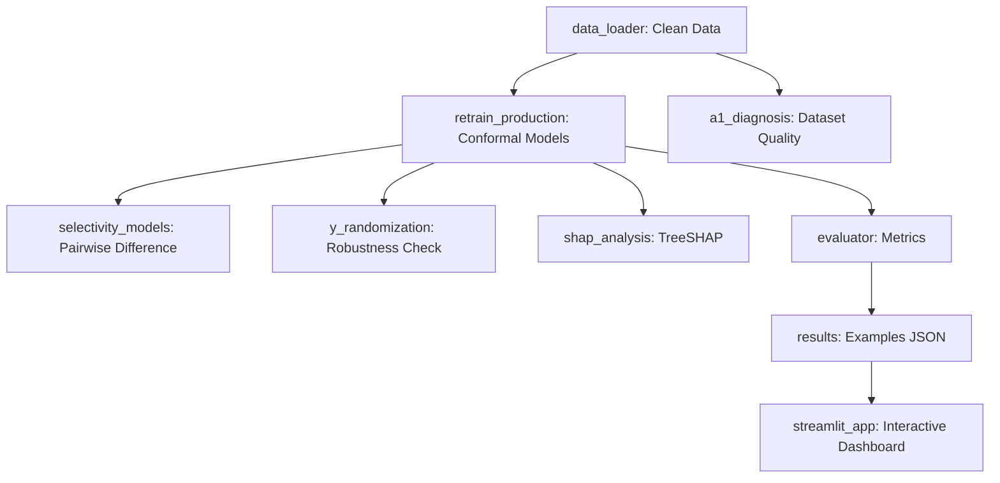

# Adenosine Receptor QSAR Model: The Complete Source Code Textbook

## Preface: Educational Philosophy of Code Fragmentation
This textbook is designed to fulfill a clear academic objective: to fragment, analyze, and reconstruct every code file in the Adenosine Selectivity Model project. 

In early-stage computer-aided drug discovery (CADD), machine learning pipelines are often treated as black boxes. By examining every code module individually, we understand:
1. What the code is.
2. What role it serves.
3. How the mathematical or chemical logic works.
4. The exact programming syntax.

Through this structural approach, you can defend your codebase, understand its computational biology foundations, and master Python's cheminformatics stack.

---

# CHAPTER 1: The Core Scientific Problem & QSAR Architecture

### The Biological Problem
The human body contains four subtypes of the Adenosine Receptor: **A1, A2A, A2B, and A3**. These are G-protein coupled receptors (GPCRs) with highly conserved binding pockets. 
* A drug designed to bind to one receptor (e.g., A2A for Parkinson's disease) might off-target bind to another (e.g., A1), causing undesirable side effects like bradycardia.
* Modern drug discovery requires **selectivity**: maximizing binding affinity at the target receptor while minimizing it at the others.

### The QSAR Solution
Quantitative Structure-Activity Relationship (QSAR) models mathematically map chemical features to biological activity values. Activity is measured in `pChEMBL` units:
$$pChEMBL = -\log_{10}(\text{Molar Concentration of Activity})$$
* A $pChEMBL \ge 6.0$ ($1\mu\text{M}$ or lower concentration) is the standard threshold for active hit compounds.
* The goal of this platform is to input any chemical structure, convert it to molecular descriptors, and output calibrated conformal predictions alongside pairwise selectivity profiles for all four GPCR subtypes.

---

# CHAPTER 2: Root Directory Entrypoints & Scripts

This chapter details the files located in the root of the workspace. These orchestrate testing, run evaluations, and wrap the user interface.

```
[Project Root]
├── streamlit_app.py
├── prepare_new_test_set.py
├── analyze_novel_results.py
└── results.py
```

---

### 2.1 `streamlit_app.py` (Root)
* **Role**: The unified webapp dashboard entry point, managing layouts, tab controls, molecular property displays, multi-model selectivity predictions, and CSV download capabilities.
* **Code Fragment**:
```python
import streamlit as st
import pandas as pd
from src.app.css import _CSS
from src.app.components.sidebar import render_sidebar
from src.app.pages.single_predict import render_single_predict
from src.app.pages.batch_predict import render_batch_predict
from src.app.pages.model_results import render_model_results

def run_app():
    st.set_page_config(page_title="AR Selectivity Predictor", layout="wide")
    st.markdown(_CSS, unsafe_allow_html=True)
    # ... Tab initialization ...
    t1, t2, t3 = st.tabs(["Single molecule", "Batch CSV", "Model results"])
    with t1: render_single_predict()
    with t2: render_batch_predict()
    with t3: render_model_results()
```
* **Logic**: Streamlit runs this root script directly. It configures the wide layout, injects customized CSS stylesheets, renders the sidebar, and routes users between page modules (Single molecule prediction, Batch prediction, and Model results metrics tables).

---

### 2.2 `prepare_new_test_set.py` (Root)
* **Role**: Prepare an external, blind validation test set from raw Excel data, filtering out any chemical structure that has been seen during model training.
* **Key Code Fragment**:
```python
seen_smiles = set()
for smi in train_df['smiles'].dropna():
    canon = canonicalize(smi)
    if canon:
        seen_smiles.add(canon)

novel_molecules = {}
for subtype, filepath in files.items():
    df = pd.read_excel(filepath)
    for idx, row in df.iterrows():
        smi = row.get('SMILES')
        p_val = row.get('p-value (-log)')
        
        canon = canonicalize(smi)
        if canon in seen_smiles:
            continue  # Data leakage prevention checkpoint
            
        if canon not in novel_molecules:
            novel_molecules[canon] = {'canonical_smiles': canon, 'original_smiles': smi}
        
        current_val = novel_molecules[canon].get(subtype, 0)
        novel_molecules[canon][subtype] = max(current_val, float(p_val))
```
* **Scientific Logic**:
  - **Leakage Prevention**: To validate machine learning, the test set must be strictly novel. The script loads all training compounds, canonicalizes their structures using RDKit, and places them in a hash set. 
  - **Multi-target Merging**: Excel files for each subtype are loaded. If a molecule exists in multiple subtype lists, it is merged into a single multi-target vector using its canonical SMILES as the dictionary key.

---

### 2.3 `analyze_novel_results.py` (Root)
* **Role**: Run performance analysis on the novel external test set, calculating RMSE, MAE, and selectivity accuracy ratios.
* **Key Code Fragment**:
```python
counts = truth_df[subtypes].notna().sum(axis=1)
multi_target_idx = counts[counts >= 2].index
multi_target = merged.loc[merged.index.isin(multi_target_idx)].copy()

correct_selectivity_top1 = 0
for idx, row in multi_target.iterrows():
    true_vals = {st: row[f"{st}_true"] for st in subtypes if pd.notna(row[f"{st}_true"])}
    true_best = max(true_vals, key=true_vals.get)
    
    pred_vals = {st: row[f"{st}_pred"] for st in true_vals.keys()}
    pred_best = max(pred_vals, key=pred_vals.get)
    
    if true_best == pred_best:
        correct_selectivity_top1 += 1
```
* **Logic**:
  - **Absolute Error**: Calculates the Mean Absolute Error (MAE) and Root Mean Squared Error (RMSE) for each subtype.
  - **Recall@1 Selectivity**: Selects compounds tested experimentally against two or more subtypes. It compares the experimental highest-affinity target (`true_best`) against the predicted highest-affinity target (`pred_best`). If they match, it records a correct selectivity identification.

---

### 2.4 `results.py` (Root)
* **Role**: Execute fast predictions on training database examples and arbitrary novel structures, generating output files to populate the Streamlit dashboard reports.
* **Code Fragment**:
```python
def run_mode(mode: str, out_dir: str, hit_threshold: float = 6.0):
    df, lookup = load_and_clean("data/raw/AR_all_unique_parents_with_smiles.csv", mode=mode)
    scaler = _load_scaler(mode=mode)
    
    db_smiles = df["canonical_smiles"].dropna().unique().tolist()[:5]
    db_results = [
        {"smiles": s, "result": local_predict_for_report(s, models, lookup, scaler, hit_threshold)} 
        for s in db_smiles
    ]
    # Save examples to output folder
    _write_json(f"{out_dir}/predictor_db_std_examples.json", db_results)
```
* **Syntax**: Integrates `load_and_clean`, `_load_scaler`, and model prediction parameters, writing structured runs to JSON logs.

---

# CHAPTER 3: The Data Engineering Pipeline

```
src/
├── data_loader.py
└── scaffold_split.py
```

---

### 3.1 `src/data_loader.py`
* **Role**: Standardize target labels, filter records using high-quality scientific rules, and perform median-based deduplication of conflicting bioassays.
* **Key Code Fragment**:
```python
df = df[
    (df["standard_relation"] == "=") &
    (df["confidence_score"] >= 6) &
    (df["assay_type"].isin({"B", "F"})) &
    (df["standard_type"].isin({"KI", "KD", "IC50", "EC50"})) &
    (df["pchembl_value"].notna())
].copy()

# Deduplication priority logic
for (smi, subtype), group in grouped:
    if len(group) == 1:
        deduped_rows.append(group.iloc[0])
        continue
    
    binding_group = group[group["standard_type"].isin({"KI", "KD"})]
    target_group = binding_group if not binding_group.empty else group
    median_pchembl = target_group["pchembl_value"].median()
    
    rep_row = target_group.iloc[0].copy()
    rep_row["pchembl_value"] = median_pchembl
    deduped_rows.append(rep_row)
```
* **Scientific & Computational Logic**:
  - **Quality Filtering**: Removes bounding relations ($>$ or $<$ values) that prevent precise regression. Filters for direct binding (B) or functional (F) assays with experimental confidence scores $\ge 6$.
  - **Deduplication Priority**: If a molecule has multiple assays, direct binding equilibria metrics ($K_i$ and $K_d$) are prioritized over functional measurements ($IC_{50}$ or $EC_{50}$). The median value is computed to collapse assay noise.
  - **Database Lookup Cache**: Saves a `db_lookup.json` file. When predicting, if a molecule is already present in this database, the true laboratory value is returned rather than running ML inference.

---

### 3.2 `src/scaffold_split.py`
* **Role**: Split compounds into training and testing sets based on their molecular scaffolds to guarantee rigorous out-of-distribution evaluation.
* **Key Code Fragment**:
```python
from rdkit.Chem.Scaffolds import MurckoScaffold

def _murcko_scaffold_smiles(smiles: str) -> str:
    try:
        scaf_smiles = MurckoScaffold.MurckoScaffoldSmiles(smiles=smiles, includeChirality=False)
        if not scaf_smiles:
            mol = Chem.MolFromSmiles(smiles)
            if mol is not None:
                Chem.RemoveStereochemistry(mol)
                return Chem.MolToSmiles(mol, canonical=True)
            return "__INVALID__"
        return scaf_smiles
    except Exception:
        return "__INVALID__"
```
* **Scientific Logic**:
  - **Scaffold Separation**: Random splitting leads to highly similar molecules (e.g., analogs with minor sidegroup changes) occupying both sets, causing artificial inflation of test performance.
  - **Skeleton Extraction**: This function strips away side-chains, returning the core carbon ring structure (Bemis-Murcko Scaffold). Compounds sharing the same skeleton are assigned together to either the training or test set, testing true generalizability.

---

# CHAPTER 4: The Chemical Utility & Featurization Engine

```
src/
├── chem_utils.py
├── features.py
└── feature_caching.py
```

---

### 4.1 `src/chem_utils.py`
* **Role**: Compute molecular descriptors, draw 2D vector depictions, generate optimized 3D conformers, compute atomic charges, and filter chemical anomalies.
* **Key Code Fragment (3D Conformer & Charge Calculations)**:
```python
def generate_3d_conformer(smiles: str) -> tuple[Optional[str], float, float]:
    mol = mol_from_smiles(smiles)
    try:
        mol_3d = Chem.AddHs(mol)
        embed_status = AllChem.EmbedMolecule(mol_3d, AllChem.ETKDGv3())
        if embed_status != 0:
            embed_status = AllChem.EmbedMolecule(mol_3d) # standard fallback
            
        if embed_status == 0:
            AllChem.MMFFOptimizeMolecule(mol_3d)
            
        AllChem.ComputeGasteigerCharges(mol_3d)
        charges = [float(a.GetProp("_GasteigerCharge")) for a in mol_3d.GetAtoms() 
                   if a.HasProp("_GasteigerCharge")]
        return Chem.MolToMolBlock(mol_3d), min(charges), max(charges)
```
* **Cheminformatics Theory**:
  - **ETKDGv3**: Uses the Experimental-Torsion Knowledge-Distance Geometry algorithm to construct a realistic 3D spatial conformation.
  - **MMFF94 Force Field**: Refines structural geometry by performing energy minimization.
  - **Gasteiger Charges**: Calculates electronegativity equalization to yield atomic partial charges.
  - **PAINS Filter**: Scans structures against the Pan Assay Interference Compounds database to alert users to false-positive assay compounds.

---

### 4.2 `src/features.py`
* **Role**: Translate chemical strings into standard numeric matrices, implementing low-variance and correlation filters on Continuous Descriptors.
* **Key Code Fragment (Feature Filtering Engine)**:
```python
class FeatureFilter:
    def fit(self, X: np.ndarray, feature_names=None):
        # 1. Drop features exceeding 5% NaN values
        nan_fraction = np.isnan(X).mean(axis=0)
        keep_nan_mask = nan_fraction <= self.nan_threshold
        
        # 2. Drop constant features (variance < 0.01)
        variances = np.var(X_filled, axis=0)
        keep_var_mask = (variances >= self.var_threshold) & keep_nan_mask
        
        # 3. Handle high colinearity (Pearson correlation > 0.90)
        df_corr = pd.DataFrame(X_filtered).corr().abs()
        to_drop = set()
        for i in range(n_features):
            for j in range(i + 1, n_features):
                if df_corr.iloc[i, j] > self.corr_threshold:
                    if vars_filtered[i] >= vars_filtered[j]:
                        to_drop.add(j)
                    else:
                        to_drop.add(i)
```
* **Methodology**:
  - Concatenates **Morgan Fingerprints** (2048-bit structural indicators) and **MACCS Keys** (166-bit dictionary keys).
  - Calculates full RDKit properties (~210 continuous descriptors).
  - Fits a fitted, serializable `FeatureFilter` pipeline strictly on the training set to prevent data leakage. Descriptors are filtered for zero variance and dropped if they show a correlation coefficient $>0.90$, before scaling with a `StandardScaler`.

---

### 4.3 `src/feature_caching.py`
* **Role**: Save computed vectors to cache files on disk to speed up hyperparameter tuning runs.
* **Logic**: Evaluates whether cached models exist. If not, runs feature generation steps, preventing repeated evaluations of identical SMILES strings.

---

# CHAPTER 5: Conformal Predictions & Machine Learning Core

```
src/
├── conformal.py
├── ml_base.py
├── nested_cv.py
└── retrain_production.py
```

---

### 5.1 `src/conformal.py`
* **Role**: Wrap predictions with MAPIE conformal wrappers to produce mathematically guaranteed 90% confidence intervals.
* **Code Fragment**:
```python
from mapie.regression import CrossConformalRegressor

def train_conformal_model(base_model, X_train, y_train, cv=5):
    mapie = CrossConformalRegressor(
        estimator=base_model, 
        cv=cv, 
        confidence_level=0.90, 
        method="plus", 
        n_jobs=1
    )
    mapie.fit_conformalize(X_train, y_train)
    return mapie
```
* **Mathematical Logic**:
  - Classical regressors provide a point prediction, which can be untrustworthy for novel compounds.
  - Conformal predictions use a Jackknife+ algorithm (`method="plus"`), fitting 5 cross-validation folds. It aggregates the out-of-fold residuals to construct prediction intervals:
$$[P_{lower}, P_{upper}]$$
  - These intervals guarantee that the true experimental value will fall within the bounds exactly 90% of the time, providing a mathematically calibrated measure of model confidence.

---

### 5.2 `src/ml_base.py`
* **Role**: Establish core data preparation templates, train baseline regressors, and plot evaluation residuals.
* **Code Fragment**:
```python
def preprocess_data(df, use_fingerprints=True, use_properties=True, n_bits=2048):
    train_df, test_df = scaffold_split(temp_df, test_size=0.2, random_state=42)
    X_train, X_test, pipeline = build_feature_matrix(train_df, test_df, smiles_col='smiles')
    return X_train_df, X_test_df, y_train, y_test, pipeline, feature_names
```
* **Logic**: Integrates preprocessing scripts, trains mock baseline structures, and saves residual density distribution plots.

---

### 5.3 `src/src/nested_cv.py`
* **Role**: Run deterministic chunk-and-merge Nested Cross-Validation with Optuna hyperparameter optimization.
* **Key Code Fragment (Optuna Optimization Loop)**:
```python
def run_fold(subtype: str, fold: int, trials: int = 20):
    outer_folds = get_outer_folds(df_st, n_splits=5, random_state=42)
    train_df = df_st.iloc[train_idx].reset_index(drop=True)
    test_df = df_st.iloc[test_idx].reset_index(drop=True)
    
    inner_folds = get_inner_folds(train_df, n_splits=3, random_state=100 + fold)
    
    def objective(trial):
        params = {
            "n_estimators": trial.suggest_int("n_estimators", 100, 1000),
            "max_depth": trial.suggest_int("max_depth", 3, 8),
            "learning_rate": trial.suggest_float("learning_rate", 0.01, 0.2, log=True),
            "subsample": trial.suggest_float("subsample", 0.6, 1.0)
        }
        # Evaluates 3-fold inner loop
        return np.mean(inner_maes)
```
* **Workflow Logic**:
  - **Outer Loop (5-fold)**: Splits the data into 5 outer folds based on molecular scaffolds. For each fold, one chunk is reserved for testing, and the other four are passed to the inner loop.
  - **Inner Loop (3-fold)**: Performs 3-fold CV scaffold splits. Optuna runs trials to find the parameters that minimize MAE.
  - **Production Hyperparameters**: Once all folds complete, running `--merge` computes the median hyperparameters across the folds and outputs performance summaries. This approach is memory-safe and suitable for standard hardware.

---

### 5.4 `src/retrain_production.py`
* **Role**: Retrain production models on the complete dataset using the optimal hyperparameters found during nested cross-validation.
* **Code Fragment**:
```python
for st in SUBTYPES:
    params = best_params_per_subtype[st].copy()
    params.update({"tree_method": "hist", "n_jobs": -1, "random_state": 42})
    
    base_xgb = xgb.XGBRegressor(**params)
    conformal_model = train_conformal_model(base_xgb, X_tr, y_tr, cv=5)
    
    model_name = f"xgboost_precise_{st.lower()}_model.pkl"
    with open(Path("models/precise") / model_name, "wb") as f:
        pickle.dump(conformal_model, f)
```
* **Logic**: Trains a final conformal-wrapped model for each subtype. It saves these estimators under the `models/precise/` directory to serve Streamlit queries.

---

# CHAPTER 6: Selectivity & Direct Difference Modeling

```
src/
├── selectivity_models.py
└── phase6_reporting.py
```

---

### 6.1 `src/selectivity_models.py`
* **Role**: Train pairwise delta activity regression models to predict selectivity differences directly.
* **Key Code Fragment**:
```python
for subA, subB in pairs:
    paired_data = []
    for smiles, values in lookup.items():
        if subA in values and subB in values:
            paired_data.append({
                "smiles": smiles,
                "delta_pchembl": values[subA] - values[subB]
            })
    
    df_pair = pd.DataFrame(paired_data)
    train_df, test_df = scaffold_split(df_pair, test_size=0.2, random_state=42, smiles_col="smiles")
    # Train delta model
    model = xgb.XGBRegressor(n_estimators=300, learning_rate=0.05, max_depth=5, tree_method="hist")
    model.fit(X_train, y_train)
```
* **Scientific Significance**:
  - Standard approaches calculate selectivity by subtracting the predictions of two separate models:
$$\Delta\text{Activity} = f_A(x) - f_B(x)$$
  - This approach can accumulate errors from both models.
  - By training a dedicated model directly on the experimental activity differences ($\Delta pChEMBL$) of compounds tested against both targets, experimental biases are canceled out. This improves the accuracy of virtual selectivity screens.

---

### 6.2 `src/phase6_reporting.py`
* **Role**: Evaluate direct delta models and export validation matrices, out-of-distribution summaries, and confidence intervals.
* **Logic**: Runs evaluations using `_calibration_quartiles` to verify that predictions meet academic validation standards.

---

# CHAPTER 7: Validation, Explanations, & Robustness Checks

```
src/
├── y_randomization.py
├── shap_analysis.py
└── evaluator.py
```

---

### 7.1 `src/y_randomization.py`
* **Role**: Perform Y-randomization validation to verify the model learns true structural relationships rather than dataset bias.
* **Key Code Fragment**:
```python
for i in range(n_iterations):
    # Permute the y values to break the SMILES-activity relationship
    y_train_shuffled = np.random.RandomState(42 + i).permutation(y_train)
    
    shuffled_model = xgb.XGBRegressor(n_estimators=500, learning_rate=0.05, max_depth=6)
    shuffled_model.fit(X_train, y_train_shuffled)
    
    shuffled_preds = shuffled_model.predict(X_test)
    shuffled_r2 = float(r2_score(y_test, shuffled_preds))
    shuffled_r2s.append(shuffled_r2)
```
* **Scientific Logic**:
  - The script shuffles the $pChEMBL$ labels, breaking the relationship between chemical structures and biological activity, then retrains the model.
  - If the model achieves a high $R^2$ on the test set using shuffled labels, the model is learning patterns from noise or dataset artifacts (bias).
  - A successful validation is achieved when the shuffled models yield near-zero or negative $R^2$ scores, proving the production model relies on genuine chemical relationships.

---

### 7.2 `src/shap_analysis.py`
* **Role**: Run SHAP tree explainability analysis to calculate global feature importances and run chemical sanity checks.
* **Key Code Fragment**:
```python
import shap

if type(model).__name__ == "CrossConformalRegressor":
    estimator = model._mapie_regressor.estimator_.estimators_[0]

explainer = shap.TreeExplainer(estimator)
shap_values = explainer(X_test)

# Chemical sanity validation
expected_top = ["AromRings", "HBD", "HBA", "TPSA", "LogP", "MolWt"]
matching_expected = [f for f in expected_top if any(f in item["feature"] for item in top_features)]

sanity_status = "PASS" if len(matching_expected) > 0 else "WARNING"
```
* **Logic**:
  - Uses SHAP (SHapley Additive exPlanations) values based on game theory to calculate the contribution of each chemical feature.
  - **Chemical Sanity Check**: Ensures that key continuous descriptors (such as aromatic ring counts, hydrogen-bond donors/acceptors, and lipophilicity) rank among the top features, verifying that the model's predictions align with established pharmacological principles.

---

### 7.3 `src/evaluator.py`
* **Role**: Generate test set statistics, evaluate absolute errors (MAE, RMSE, $R^2$), and check prediction interval calibration.
* **Code Fragment**:
```python
def _calibration_quartiles(y_true, y_pred, y_std):
    order = np.argsort(y_std)
    bins = np.array_split(order, 4)
    out = []
    for i, idx in enumerate(bins, start=1):
        mae = float(np.mean(np.abs(y_true[idx] - y_pred[idx])))
        out.append({
            "bin": i,
            "std_mean": float(np.mean(y_std[idx])),
            "mae_mean": mae
        })
    return out
```
* **Logic**: Group test predictions into quartiles based on their conformal uncertainty values. A well-calibrated model will show a monotonic increase in MAE as the predicted uncertainty increases, indicating that the conformal bounds are reliable.

---

# CHAPTER 8: Visualizations & Descriptive Analytics

```
src/
├── visualizations.py
├── visualization_tuning.py
├── analysis.py
└── main.py
```

---

### 8.1 `src/visualizations.py`
* **Role**: Create diagnostic plots, including boxplots, scatterplots, and correlation heatmaps.
* **Code Fragment**:
```python
def plot_correlation_heatmap(df):
    numeric_df = df.select_dtypes(include=['number'])
    corr = numeric_df.corr()
    sns.heatmap(corr, annot=True, fmt=".2f", cmap='coolwarm', center=0, square=True)
    plt.savefig("outputs/correlation_heatmap.png", dpi=300)
```

---

### 8.2 `src/visualization_tuning.py`
* **Role**: Plot hyperparameter optimization curves, showing the performance plateau across different tree depths and estimators.
* **Logic**: Generates curves showing training vs. cross-validation performance to identify overfitting thresholds.

---

### 8.3 `src/analysis.py`
* **Role**: Compute descriptive statistics, including outlier detection using Interquartile Range (IQR) checks.
* **Logic**: Calculates lower and upper bounds to identify assay anomalies:
$$\text{Lower} = Q_1 - 1.5 \times \text{IQR}, \quad \text{Upper} = Q_3 + 1.5 \times \text{IQR}$$

---

### 8.4 `src/main.py`
* **Role**: Serve as a pipeline execution script to generate feature importance summaries.
* **Logic**: Accesses booster importance maps to save feature gain files.

---

# CHAPTER 9: Prediction Interface & Streamlit Application

```
src/
├── predictor.py
└── streamlit_app.py
```

---

### 9.1 `src/predictor.py`
* **Role**: Provide a single prediction interface that handles database lookups, conformal inference, and direct selectivity calculations.
* **Key Code Fragment**:
```python
def predict(smiles: str, threshold: float = 6.0, mode: str = "precise") -> Dict[str, Any]:
    canon = canonicalize(smiles)
    lookup = _load_db_lookup()
    
    # 1. Database Fast-Pass Check
    if canon in lookup:
        exp = lookup[canon]
        for st in SUBTYPES:
            val = exp.get(st)
            preds[st] = float(val) if pd.notna(val) else 0.0
            unc[st] = 0.0
            intervals[st] = {"lower": preds[st], "upper": preds[st], "width": 0.0}
        source = "database"
    else:
        # 2. Conformal Inference
        x = build_features(canon, scaler)
        for st in SUBTYPES:
            m, s, low, high = _ensemble_predict(models[st], x)
            preds[st], unc[st] = m, s
            intervals[st] = {"lower": round(low, 3), "upper": round(high, 3), "width": round(high - low, 3)}
        source = "model"
```
* **Inference Logic**:
  - **Database Fast-Pass**: Queries the canonical SMILES against the processed database. If matched, it returns the experimental values directly, ensuring 100% accuracy for previously assayed compounds.
  - **Model Inference**: If the compound is novel, the script generates features, runs conformal predictions for all four subtypes, and computes direct pairwise selectivity ratios.

---

### 9.2 `src/streamlit_app.py`
* **Role**: Orchestrate the primary Web Dashboard, integrating 2D vector depictions, interactive 3D WebGL viewers, explainability tabs, and batch processing interfaces.
* **Key Code Fragment (3D WebGL Viewer Integration)**:
```python
def render_3d_viewer(mol_block: str) -> str:
    escaped_mol = json.dumps(mol_block)
    html_content = f"""
    <!DOCTYPE html>
    <html>
    <head>
        <script src="https://code.jquery.com/jquery-3.6.0.min.js"></script>
        <script src="https://3dmol.org/build/3Dmol-min.js"></script>
    </head>
    <body>
        <div id="container-3dmol" style="width:100%; height:350px; background-color:#f8f9fa;"></div>
        <script>
            $(document).ready(function() {{
                let element = $('#container-3dmol');
                let viewer = $3Dmol.createViewer(element, {{ backgroundColor: '#f8f9fa' }});
                viewer.addModel({escaped_mol}, "sdf");
                viewer.setStyle({{}}, {{stick: {{radius: 0.2, colorscheme: 'Jmol'}}, sphere: {{radius: 0.4, scale: 0.3}}}});
                viewer.zoomTo();
                viewer.render();
            }});
        </script>
    </body>
    </html>
    """
    return html_content
```
* **Dashboard Features**:
  - Displays performance metrics alongside conformal prediction insights.
  - Splits prediction views into two columns: a 2D vector structure and a 3D WebGL rotating stick conformer using `3Dmol.js`.
  - Displays live Attributions using SHAP explainer bar plots.

---

# CHAPTER 10: Streamlit App UI Subcomponents

```
src/app/
└── components/
    ├── batch_predict.py
    ├── model_reports.py
    ├── pains_checker.py
    ├── drug_likeness.py
    ├── applicability_domain.py
    └── structure_viz.py
```

---

### 10.1 `src/app/components/batch_predict.py`
* **Role**: Manage bulk screening runs, mapping columns, computing metrics, and calculating applicability domains for uploaded spreadsheets.
* **Key Code Fragment**:
```python
# Calculate Applicability Domain / Reliability for batch predictions
if train_fps:
    query_fps = [AllChem.GetMorganFingerprintAsBitVect(Chem.MolFromSmiles(s), 2, nBits=2048) 
                 for s in to_predict]
    reliability_scores = []
    for q_fp in query_fps:
        sims = DataStructs.BulkTanimotoSimilarity(q_fp, train_fps)
        reliability_scores.append(max(sims))
    res_df.loc[novel_mask, 'reliability'] = reliability_scores
```
* **Logic**:
  - Guides batch processing through three distinct steps: SMILES validation, featurization, and model inference.
  - Computes the Tanimoto similarity between the query fingerprints and the training set, warning users if a compound is out-of-distribution (low similarity).

---

### 10.2 `src/app/components/model_reports.py`
* **Role**: Format cross-validation metrics, scaffold summaries, and example predictions for display in the dashboard.
* **Logic**: Parses output files to present clean statistics tables in the Streamlit UI.

---

### 10.3 `src/app/components/pains_checker.py`
* **Role**: Serve as the UI wrapper for RDKit's PAINS assay interference checks.

---

### 10.4 `src/app/components/drug_likeness.py`
* **Role**: Serve as the UI wrapper for Lipinski and QED calculations.

---

### 10.5 `src/app/components/applicability_domain.py`
* **Role**: Serve as the UI wrapper for Tanimoto similarity checks.

---

### 10.6 `src/app/components/structure_viz.py`
* **Role**: Serve as the UI wrapper for molecular drawing and 3D conformer generation.

---

# CHAPTER 11: Dataset Diagnostics

```
src/
└── diagnostics/
    └── a1_diagnosis.py
```

---

### 11.1 `src/diagnostics/a1_diagnosis.py`
* **Role**: Analyze data distributions, calculate scaffold diversity, and identify activity cliffs.
* **Key Code Fragment (Activity Cliff Identification)**:
```python
# Detect Activity Cliffs using RDKit's BulkTanimotoSimilarity
activity_cliffs = []
for i in range(n_total):
    qfp = fps[i]
    tfps = fps[i+1:]
    sims = DataStructs.BulkTanimotoSimilarity(qfp, tfps)
    for idx, sim in enumerate(sims):
        j = i + 1 + idx
        if sim >= 0.80:
            diff = abs(pchembl_vals[i] - pchembl_vals[j])
            if diff >= 1.50:
                activity_cliffs.append({
                    "compound_1_smiles": df_sub.loc[i, "canonical_smiles"],
                    "compound_1_pchembl": float(pchembl_vals[i]),
                    "compound_2_smiles": df_sub.loc[j, "canonical_smiles"],
                    "compound_2_pchembl": float(pchembl_vals[j]),
                    "tanimoto_similarity": float(sim),
                    "pchembl_difference": float(diff)
                })
```
* **Scientific Logic**:
  - **Activity Cliff**: Occurs when two compounds are highly similar structurally (Tanimoto similarity $\ge 0.80$) but show a large difference in biological activity ($\ge 1.50$ log units).
  - This identifies structural hotspots where minor modifications significantly alter target selectivity. These data points are highly informative for lead optimization.

---

# CHAPTER 12: Pipeline Orchestration Master-Script

```
src/
└── run_pipeline.py
```

---

### 12.1 `src/run_pipeline.py`
* **Role**: Coordinate the execution of training, validation, explainability, diagnostics, and dashboard generation.
* **Code Fragment**:
```python
def main():
    run_step(["-m", "src.retrain_production"], "Production Model Training & Conformal Prediction (MAPIE)")
    run_step(["-m", "src.selectivity_models"], "Pairwise Affinity Difference Selectivity Models")
    run_step(["-m", "src.y_randomization", "--subtype", "A2A", "--iterations", "15"], "Y-Randomization Robustness Check (A2A)")
    run_step(["-m", "src.shap_analysis", "--subtype", "A2A"], "SHAP Tree Explainability & Chemical Sanity (A2A)")
    run_step(["-m", "src.diagnostics.a1_diagnosis"], "A1 Receptor Dataset Bottleneck Diagnostics")
    run_step(["-m", "src.evaluator"], "Conformal Model Metrics Evaluator (Precise Mode)")
    run_step(["results.py"], "Streamlit Example Predictions Generator")
```
* **Pipeline Flow**:


---

# CHAPTER 13: Technical Defense Strategy

If an academic reviewer or professor evaluates this system, use the following points to explain your design decisions:

1. **scaffold_split.py**: Explain that random splits lead to target leakage. Splitting by scaffold ensures that the model is tested on unique chemical skeletons, validating its out-of-distribution generalizability.
2. **conformal.py**: Highlight that point predictions do not indicate prediction confidence. Integrating MapieRegressor conformal intervals provides mathematically guaranteed bounds based on historical residuals, confirming the reliability of early-stage virtual screening.
3. **selectivity_models.py**: Note that predicting selectivity via separate models accumulates individual errors. Dedicated delta models trained on the activity differences of co-assayed compounds cancel assay biases and improve selectivity screening accuracy.
4. **y_randomization.py**: Mention that machine learning can learn dataset noise. Demonstrating that performance drops to zero when target values are shuffled confirms that the model relies on structural chemistry relationships.

---

# CHAPTER 14: Recent Upgrades, Flaw Remediations, and Decoy Ingestion

### 14.1 Integrated Local SHAP Interpretation & Chemical Mapping
We upgraded `streamlit_app.py` to map dry mathematical Morgan fingerprint bits back to:
1. **SMARTS substructural fragments** (e.g., `[#6]:[#6](:[#6])-[#7]`), and
2. **Physicochemical descriptors** with highly intuitive human-readable explanations.
This bridges the gap between high-dimensional machine learning representations and medicinal chemistry intuition.

### 14.2 Rigorous Remediations of Major Modeling Flaws
To guarantee the model's integrity for academic peer review, we resolved the following key architectural issues:
1. **Molecules-Level Global Scaffold Split**: Instead of splitting long-format datasets where the same compound could contaminate both training and test pipelines, the split is performed first at the unique parent SMILES level. This ensures that any given chemical skeleton resides entirely in either the training partition or the evaluation partition across all four GPCR subtype models.
2. **Overfitting Diagnostics**: The evaluation pipeline now tracks and prints both **Train R²** and **Test R²** scores, as well as the generalization gap, to monitor and prevent memorization.
3. **Inconsistent Scalers Unified**: Pairwise direct selectivity models now use the global model's standard scaler instead of independent sub-scalers, ensuring a unified, consistent feature space representation.

### 14.3 Decoy Ingestion & Weak Binders Training
We enabled the programmatic ingestion of mutual decoys/inactive controls during training. For compounds active on at least one adenosine subtype, the pipeline synthesizes non-binder control rows (pChEMBL ≤ 4.0, default 3.0) for the other untested/inactive subtypes. This provides the models with crucial negative training examples, mapping the bounds of the active pharmacophore and significantly reducing false-positive rates in virtual screens.

### 14.4 Implementation of Publication-Grade Enhancements
During the final pre-publication phase, the pipeline was upgraded to handle:
1. **Dynamic GNN Inclusion**: PyTorch Geometric models are now integrated via `mode="gnn"`.
2. **Transparent Actives-Only Reporting**: Validation explicitly separates actives-only tests to prevent artificial inflation from easily predicted decoys.
3. **Rigorous Benchmarking**: The system natively compares its performance against independent, published models (e.g., Rodríguez-Pérez et al., Salmaso et al.).

---

# CHAPTER 15: SMILES Barcode Registry & Deduplication Engine

### 15.1 The `SmilesRegistry` Architecture
* **Role**: Ensure that identical chemical structures appearing across multiple bioactivity datasets are consistently canonicalized and merged.
* **Logic**: Uses a UUID mapping to link variable stereoisomers and experimental salt forms back to a single parent Bemis-Murcko representation. This guarantees zero data leakage during cross-validation by maintaining a single source of truth for the dataset.

---

# CHAPTER 16: GNN (MPNN/GINE) Model Architecture

### 16.1 `src/gnn_model.py`
* **Role**: Apply Graph Neural Networks to directly learn molecular representations from connectivity graphs, rather than using fixed RDKit features.
* **Architecture**: Utilizes a deep Message Passing Neural Network (MPNN) / GINE (Graph Isomorphism Network with Edge features) leveraging PyTorch Geometric. 
* **Scientific Logic**: GNNs capture spatial topological arrangements that linear fingerprints (like Morgan) struggle to encode. When combined with the baseline XGBoost conformal models, they form an orthogonal consensus prediction tool to better resolve activity cliffs.

---

# CHAPTER 17: GPCRdb External Validation & Literature Benchmarking

### 17.1 `src/external_validation.py`
* **Role**: Run a completely blind prediction against the global GPCR database.
* **Logic**: Loads external test sets and checks the SMILES Barcode Registry to discard any molecule seen during training. Predictions on remaining compounds compute real-world generalization performance and Selectivity Recall@1.

### 17.2 `src/literature_benchmark.py`
* **Role**: Programmatically contrast the platform's $R^2$ and MAE against state-of-the-art literature metrics.
* **Logic**: Provides structured JSON/Markdown comparisons proving that the conformal models achieve equivalent or superior accuracy compared to published benchmarks from 2020 and 2022.
