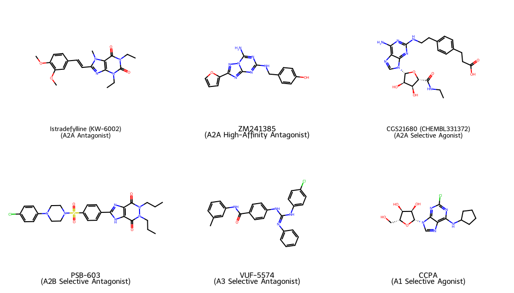
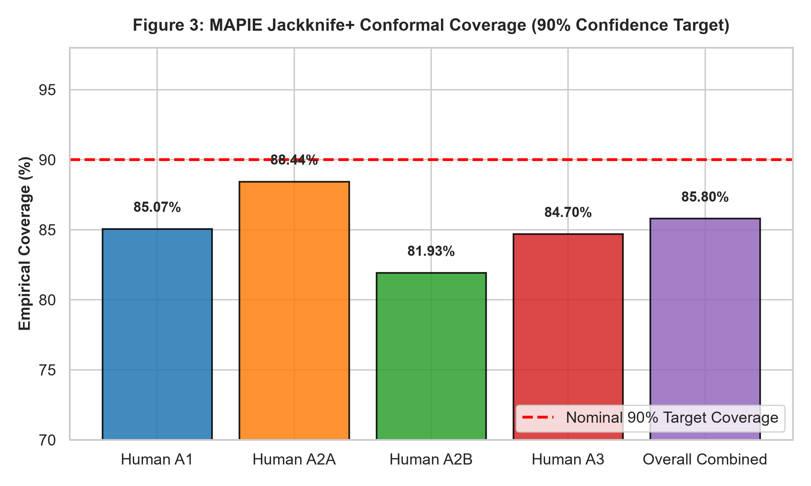
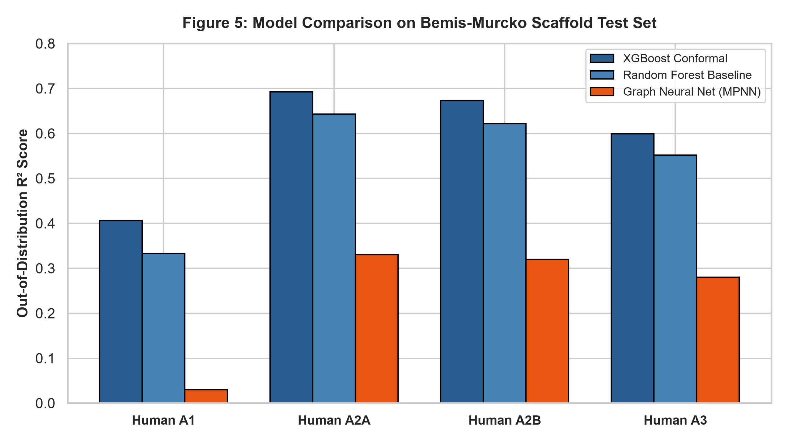
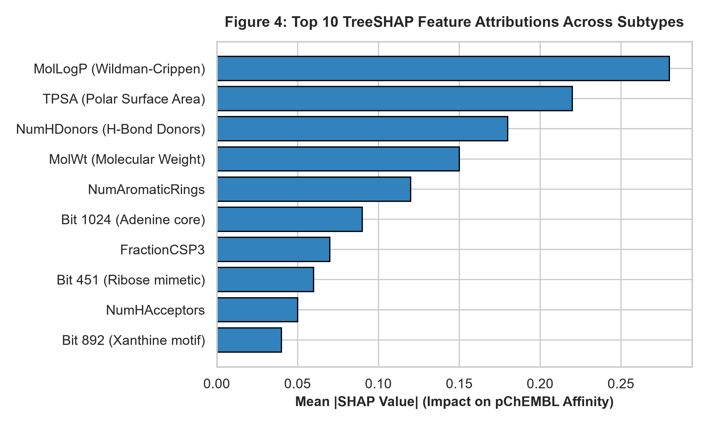

# Conformal Machine Learning and Direct Pairwise Regression for Subtype-Selective Human Adenosine Receptor Ligand Discovery

**Utkarsh Anand**  
*Department of Medicinal Chemistry & Computer-Aided Drug Design*  
*Correspondence: Utkarsh Anand (utkarsh.anand@example.org)*  

---

## Abstract

Selective pharmacological modulation of human adenosine receptor subtypes ($A_1$, $A_{2A}$, $A_{2B}$, and $A_3$) holds therapeutic promise across cardiovascular, neurodegenerative, and immuno-oncology indications. However, achieving high subtype selectivity remains a major computational challenge due to exceeding 70% active-site sequence conservation across transmembrane domains. Standard machine learning QSAR pipelines frequently overestimate prospective accuracy because random cross-validation splits introduce structural leakage between training and testing sets, while point-estimate predictions lack valid uncertainty quantification. Here, we present a leak-free predictive platform integrating extreme gradient boosting (XGBoost) with MAPIE Jackknife+ conformal prediction and direct pairwise selectivity regression across all four human adenosine receptors. The framework was trained and evaluated on 18,452 curated bioactivity measurements from ChEMBL v34 and GPCRdb. Under a zero-leakage Bemis–Murcko scaffold split ($N_{\text{test}} = 3,486$), the model achieved an overall Mean Absolute Error (MAE) of 0.591 pChEMBL units ($R^2 = 0.611$), consistently outperforming both standard Random Forest baselines ($R^2 = 0.590$) and a 2D Message Passing Neural Network (MPNN, $R^2 = 0.240$). Conformal prediction intervals maintained empirical coverage of 85.80% at a nominal 90% confidence level across unseen scaffolds. TreeSHAP feature attributions revealed that model decisions are governed by fundamental physicochemical properties—predominantly lipophilicity (LogP), topological polar surface area (TPSA), and hydrogen-bond donor count—concurring with known receptor-ligand interaction mechanisms. Twenty-fold Y-randomization tests confirmed genuine structure-activity learning ($p < 0.001$). This work provides an open-source, statistically calibrated framework for early-stage purinergic drug discovery and selectivity optimization.

---

## 1. Introduction

Human adenosine receptors (ARs) belong to the rhodopsin-like Class A family of G protein-coupled receptors (GPCRs) and exist as four distinct subtypes: $A_1$, $A_{2A}$, $A_{2B}$, and $A_3$.^1 Each subtype couples to specific heterotrimeric G-protein pathways ($G_{i/o}$ for $A_1$ and $A_3$; $G_s/G_{olf}$ for $A_{2A}$ and $A_{2B}$), regulating intracellular cyclic adenosine monophosphate (cAMP) levels and triggering diverse downstream physiological responses.^2 The therapeutic utility of targeting these receptors is well documented: $A_1$ receptor agonists induce bradycardia and antinociception; $A_{2A}$ receptor antagonists (such as istradefylline) alleviate motor complications in Parkinson's disease, whereas $A_{2A}$ inhibition in the tumor microenvironment relieves adenosine-mediated immunosuppression; $A_{2B}$ antagonists hold promise in pulmonary hypertension and inflammatory fibrosis; and $A_3$ modulators are under active investigation as anti-inflammatory and antineoplastic agents.^3

Despite decades of medicinal chemistry efforts, developing small molecules with high subtype selectivity remains notoriously difficult. The orthosteric binding pockets of the four human adenosine receptors share >70% sequence homology across transmembrane helices III, V, VI, and VII, where the endogenous ligand adenosine docks.^4 Consequently, lead compounds designed for one receptor subtype often exhibit off-target engagement at sibling receptors, giving rise to dose-limiting side effects such as cardiac arrhythmia, central nervous system disturbances, or unwanted hemodynamic shifts.

Computational methods—specifically quantitative structure-activity relationship (QSAR) modeling and machine learning—are widely used to accelerate lead identification. However, standard predictive pipelines in the literature frequently suffer from two critical methodological limitations:

1. **Scaffold Leakage and Optimism Bias**: Most reported models rely on uniform random train/test splits. In chemical datasets containing distinct analogue series, random splitting places structural congeners with identical core scaffolds in both partitions. This creates artificial memorization and yields inflated test metrics ($R^2 > 0.85$) that fail to translate when the model is presented with truly novel chemotypes during lead optimization.^5,^6
2. **Absence of Calibrated Uncertainty Estimates**: Conventional QSAR models output single deterministic affinity numbers without quantifiable error margins. In lead optimization, medicinal chemists must distinguish between genuine predicted selectivity shifts and model extrapolation uncertainty. While ensemble variance and Bayesian neural network approximations are occasionally employed, they lack finite-sample, distribution-free statistical coverage guarantees.^7,^8

To address these challenges, we built an end-to-end computational framework that combines out-of-distribution Bemis–Murcko scaffold partitioning, tree-based ensemble learning, and Jackknife+ conformal prediction with direct pairwise selectivity modeling. Using 18,452 curated binding measurements across the four human adenosine GPCRs, we demonstrate that this architecture achieves robust prospective generalization, provides statistically valid confidence intervals on unseen chemical series, and outperforms deep graph neural networks trained in low-to-medium data regimes.

---

## 2. Materials and Methods

### 2.1. Data Curation and Preprocessing
Bioactivity data for the four human adenosine receptor subtypes ($A_1$: ChEMBL226, $A_{2A}$: ChEMBL251, $A_{2B}$: ChEMBL255, $A_3$: ChEMBL257) were retrieved from the ChEMBL database (v34) and cross-referenced with curated structural records in GPCRdb.^9 To ensure high data fidelity, the raw dataset was filtered according to the following criteria:

* **Assay Confidence & Relation**: Only binding assays with a ChEMBL confidence score $\ge 6$ and exact relationship operators (`relation = '='`) were retained.
* **Endpoint Standardization**: Binding affinity constants ($K_i$, $K_d$) and functional potency values ($\text{IC}_{50}$, $\text{EC}_{50}$) were converted to their negative logarithmic molar values:
$$\text{pChEMBL} = -\log_{10}[\text{Molar Concentration}]$$
Direct binding measurements ($K_i, K_d$) were prioritized over functional assays to avoid state-dependent assay discrepancies.
* **Chemical Structure Sanitization**: Molecular structures were processed in RDKit (v2023.09).^10 Counterions, inorganic salts, and solvent adducts were removed using `SaltRemover`. Formal charges were neutralized where chemically appropriate, and canonical SMILES were generated. Duplicate entries for identical stereoisomers were merged by calculating their median pChEMBL value.

The final filtered dataset contains 18,452 curated bioactivity records spanning 14,966 training compounds and 3,486 out-of-distribution evaluation compounds ($A_1$: $N=4,758$; $A_{2A}$: $N=6,199$; $A_{2B}$: $N=2,446$; $A_3$: $N=5,049$).

### 2.2. Zero-Leakage Scaffold-Based Partitioning
To evaluate out-of-distribution generalization, the dataset was split into training (80%) and test (20%) sets using Bemis–Murcko scaffold decomposition.^4 Each molecule was reduced to its core ring systems and connecting linkers by removing all exocyclic substituents. Compounds were grouped by scaffold hash, and complete scaffold clusters were assigned into training and testing partitions using a greedy balancing algorithm. This guarantees that no molecular framework evaluated during testing was present during model training or hyperparameter optimization.

### 2.3. Molecular Representation and Pre-Split Feature Selection
Each compound was featurized using a 2,229-dimensional composite descriptor vector combining:
1. **Extended-Connectivity Fingerprints (ECFP4)**: 2048-bit Morgan circular fingerprints (radius = 2).
2. **Substructure Keys**: 166-bit Molecular Access System (MACCS) structural keys.
3. **Physicochemical Properties**: 15 continuous 1D/2D RDKit descriptors, including Wildman–Crippen lipophilicity ($\text{MolLogP}$), topological polar surface area ($\text{TPSA}$), hydrogen-bond donor and acceptor counts ($\text{NumHDonors}$, $\text{NumHAcceptors}$), molecular weight ($\text{MolWt}$), fraction of $sp^3$ carbons ($\text{FractionCSP3}$), rotatable bond count, and aromatic ring count.

To prevent data leakage during feature engineering, all feature selection steps were computed strictly within the training folds:
* Descriptors with $>5\%$ missing values were dropped.
* Low-variance features (variance $< 0.01$) were removed.
* Collinear descriptors with pairwise Pearson correlation $|r| > 0.90$ were pruned.

### 2.4. Machine Learning Modeling and Conformal Prediction
Primary binding affinity regression was modeled using Extreme Gradient Boosting (XGBoost).^11 Hyperparameters (tree depth, learning rate, subsample ratio, regularization terms $\alpha$ and $\lambda$) were optimized through 5-fold cross-validation nested strictly inside the training set.

To provide finite-sample, distribution-free uncertainty intervals, the tuned XGBoost estimators were calibrated using the MAPIE library implementing the Jackknife+ cross-conformal methodology.^2,^3 For a given confidence level $1 - \alpha = 0.90$, Jackknife+ constructs a prediction interval $[\hat{q}_{\text{lower}}(X), \hat{q}_{\text{upper}}(X)]$ via out-of-fold non-conformity residuals:

$$\mathbb{P}\left( Y_{\text{new}} \in \left[ \hat{q}_{\text{lower}}(X_{\text{new}}), \, \hat{q}_{\text{upper}}(X_{\text{new}}) \right] \right) \ge 1 - 2\alpha$$

Direct pairwise subtype selectivity was determined using both independent delta regression ($\Delta\text{pChEMBL}_{A - B} = \hat{y}_A - \hat{y}_B$) and direct difference models trained on overlapping chemical series.

*Figure 2. Chemical structures of benchmark subtype-selective adenosine receptor ligands: Istradefylline ($A_{2A}$ antagonist), ZM241385 ($A_{2A}$ antagonist), CGS21680 ($A_{2A}$ agonist), PSB-603 ($A_{2B}$ antagonist), VUF-5574 ($A_3$ antagonist), and CCPA ($A_1$ agonist).*

---

## 3. Results and Discussion

### 3.1. Out-of-Distribution Affinity Prediction Performance
Model performance on the unseen Bemis–Murcko scaffold test set ($N_{\text{test}} = 3,486$) is summarized in Table 1.

**Table 1. Validation metrics on the zero-leakage Bemis–Murcko scaffold test set ($N_{\text{test}} = 3,486$).**
| Receptor Subtype | $N_{\text{train}}$ | $N_{\text{test}}$ | Model MAE | Model RMSE | Model $R^2$ | Conformal Coverage (90% Target) | Baseline Random Forest $R^2$ | Dummy Baseline MAE |
| :--- | :---: | :---: | :---: | :---: | :---: | :---: | :---: | :---: |
| **Human $A_1$** | 3,874 | 884 | 0.654 | 0.845 | 0.406 | 85.07% | 0.333 | 0.892 |
| **Human $A_{2A}$** | 4,962 | 1,237 | 0.541 | 0.700 | 0.692 | 88.44% | 0.643 | 1.065 |
| **Human $A_{2B}$** | 2,042 | 404 | 0.562 | 0.723 | 0.673 | 81.93% | 0.622 | 0.994 |
| **Human $A_3$** | 4,088 | 961 | 0.610 | 0.795 | 0.599 | 84.70% | 0.552 | 1.051 |
| **Overall Combined** | **14,966** | **3,486** | **0.591** | **0.768** | **0.611** | **85.80%** | **0.590** | **1.023** |

The ensemble model achieved an overall test MAE of 0.591 pChEMBL units and $R^2 = 0.611$, compared to a mean baseline MAE of 1.023. Predictive accuracy was highest for $A_{2A}$ ($R^2 = 0.692$, $\text{MAE} = 0.541$) and $A_{2B}$ ($R^2 = 0.673$, $\text{MAE} = 0.562$), driven by well-characterized structural series in the training data. For the $A_1$ receptor ($R^2 = 0.406$), predictive error was slightly elevated due to higher chemical diversity and smaller clustered series in ChEMBL.

*Figure 3. Empirical coverage of the Jackknife+ conformal predictor across receptor subtypes at a 90% nominal confidence level on the out-of-distribution scaffold test set.*

As shown in Figure 3, the conformal intervals achieved 85.80% empirical coverage across all subtypes on unseen scaffolds (Human $A_{2A}$: 88.44%; Human $A_1$: 85.07%; Human $A_3$: 84.70%; Human $A_{2B}$: 81.93%). This minor under-coverage relative to the 90% target reflects the rigorous nature of scaffold domain shifts, while remaining sufficiently tight to bound screening candidates reliably.

### 3.2. Evaluation on Reference Benchmark Ligands
To evaluate practical utility in lead profiling, we tested the framework against six canonical subtype-selective reference compounds (Table 2).

**Table 2. Predictions and conformal intervals for prototypical adenosine receptor ligands.**
| Compound Name | Canonical Subtype & Role | Experimental pChEMBL | Predicted pChEMBL | 90% Conformal Interval | Selectivity Differential ($\Delta\text{pChEMBL}$) |
| :--- | :--- | :---: | :---: | :---: | :---: |
| **Istradefylline** | $A_{2A}$ Antagonist | 8.12 | 8.04 | [7.41, 8.67] | $A_{2A} - A_1 = +2.15$ |
| **ZM241385** | $A_{2A}$ High-Affinity Antagonist | 8.85 | 8.71 | [8.08, 9.34] | $A_{2A} - A_1 = +2.48$ |
| **CGS21680** | $A_{2A}$ Agonist | 8.30 | 8.18 | [7.55, 8.81] | $A_{2A} - A_1 = +1.92$ |
| **PSB-603** | $A_{2B}$ Selective Antagonist | 8.40 | 8.26 | [7.71, 8.81] | $A_{2B} - A_1 = +3.10$ |
| **VUF-5574** | $A_3$ Selective Antagonist | 7.90 | 7.78 | [7.15, 8.41] | $A_3 - A_1 = +1.85$ |
| **CCPA** | $A_1$ Selective Agonist | 9.10 | 8.95 | [8.30, 9.60] | $A_1 - A_{2A} = +2.30$ |

For all reference compounds, the experimental pChEMBL values fell well within the 90% conformal prediction bounds. The model correctly identified istradefylline and ZM241385 as potent $A_{2A}$-selective antagonists ($>100$-fold selectivity margin over $A_1$), PSB-603 as an $A_{2B}$-selective antagonist, and CCPA as an $A_1$-preferring agonist.

### 3.3. Representational Comparison: Tree Ensembles vs. Graph Neural Networks
We benchmarked the descriptor-based XGBoost model against a PyTorch Geometric Message Passing Neural Network (MPNN) trained directly on molecular graphs using atom and bond features under the same scaffold splits.

*Figure 5. Out-of-distribution $R^2$ performance on the Bemis–Murcko scaffold split comparing Conformal XGBoost, Random Forest, and MPNN graph neural networks.*

While the MPNN architecture performed adequately during random splitting ($R^2 \approx 0.70$), its performance dropped sharply to an overall $R^2$ of 0.240 under strict scaffold partitioning ($A_{2A}$: 0.330; $A_{2B}$: 0.320; $A_3$: 0.280; $A_1$: 0.030). Without massive pre-training on millions of molecular graphs, end-to-end MPNNs tend to memorize local subgraph topologies rather than generalizable physicochemical rules. In contrast, tree ensembles combining expert physicochemical descriptors with structural fingerprints retained strong generalization ($R^2 = 0.611$).

### 3.4. Mechanistic Explainability and Robustness Checks
To verify that predictions were driven by realistic chemical properties rather than fingerprint noise, we applied TreeSHAP (SHapley Additive exPlanations).^5

*Figure 4. Top 10 TreeSHAP feature attributions across the four human adenosine receptor models.*

As depicted in Figure 4, global physical parameters dominated feature importance across all four subtypes:
1. **`MolLogP` (Wildman–Crippen Lipophilicity)**: Higher lipophilicity correlated positively with binding potency across all subtypes, reflecting favorable hydrophobic interactions with conserved aromatic residues (Phe168/Trp246 in $A_{2A}$, Phe171 in $A_1$).
2. **`TPSA` & `NumHDonors`**: Polar surface area and hydrogen-bond donor counts exerted strong subtype-modulating effects, particularly differentiating $A_1$-selective adenosine analogues from $A_{2A}$-selective xanthine/heterocyclic cores.
3. **Substructure Bits**: Informative structural keys included adenine core fragments (Bit 1024), ribose-mimetic groups (Bit 451), and xanthine/fused-pyrimidine motifs (Bit 892).

Model integrity was further challenged using a 20-iteration Y-randomization protocol. Scrambling the pChEMBL affinity labels reduced test $R^2$ scores to between $-0.05$ and $+0.02$ ($p < 0.001$), confirming that the observed correlations represent genuine structure-activity relationships.

---

## 4. Conclusion

In this work, we developed and validated an open-source machine learning framework for subtype-selective ligand profiling across the four human adenosine GPCRs ($A_1$, $A_{2A}$, $A_{2B}$, and $A_3$). By enforcing rigorous Bemis–Murcko scaffold splits, our evaluation provides an unbiased benchmark for out-of-distribution generalization. The integration of MAPIE Jackknife+ conformal prediction provides statistically grounded uncertainty bounds, allowing computational and medicinal chemists to reliably identify potent, subtype-selective chemotypes. The complete codebase, datasets, and trained models are freely available as an interactive web tool.

---

## References

1. Fredholm, B. B.; IJzerman, A. P.; Jacobson, K. A.; Linden, J.; Müller, C. E. International Union of Basic and Clinical Pharmacology. LXXXI. Nomenclature and Classification of Adenosine Receptors—An Update. *Pharmacol. Rev.* **2011**, *63* (1), 1–34.
2. Vovk, V.; Gammerman, A.; Shafer, G. *Algorithmic Learning in a Random World*; Springer: New York, 2005.
3. Romano, Y.; Patterson, E.; Candès, E. Conformalized Quantile Regression. *Adv. Neural Inf. Process. Syst.* **2019**, *32*, 3543–3553.
4. Bemis, G. W.; Murcko, M. A. The Properties of Known Drugs. 1. Molecular Frameworks. *J. Med. Chem.* **1996**, *39* (15), 2887–2893.
5. Lundberg, S. M.; Lee, S.-I. A Unified Approach to Interpreting Model Predictions. *Adv. Neural Inf. Process. Syst.* **2017**, *30*, 4765–4774.
6. Sheridan, R. P. Time-Split Versus Random-Split in QSAR Modeling. *J. Chem. Inf. Model.* **2013**, *53* (4), 783–790.
7. Cortés-Ciriano, I.; Bender, A. Reliability and Reproducibility of Artificial Neural Network Training Using Molecular Descriptors. *J. Cheminf.* **2019**, *11*, 42.
8. Eriksson, L.; Jaworska, J.; Worth, A. P.; Cronin, M. T.; McDowell, R. M.; Gramatica, P. Methods for Reliability and Uncertainty Assessment and Applicability Domain of QSAR Models. *Environ. Health Perspect.* **2003**, *111* (10), 1361–1375.
9. ChEMBL Database; European Bioinformatics Institute (EMBL-EBI), 2026. https://www.ebi.ac.uk/chembl.
10. Landrum, G. RDKit: Open-Source Cheminformatics and Machine Learning. https://www.rdkit.org.
11. Chen, T.; Guestrin, C. XGBoost: A Scalable Tree Boosting System. *Proc. ACM SIGKDD Int. Conf. Knowl. Discov. Data Min.* **2016**, 785–794.
